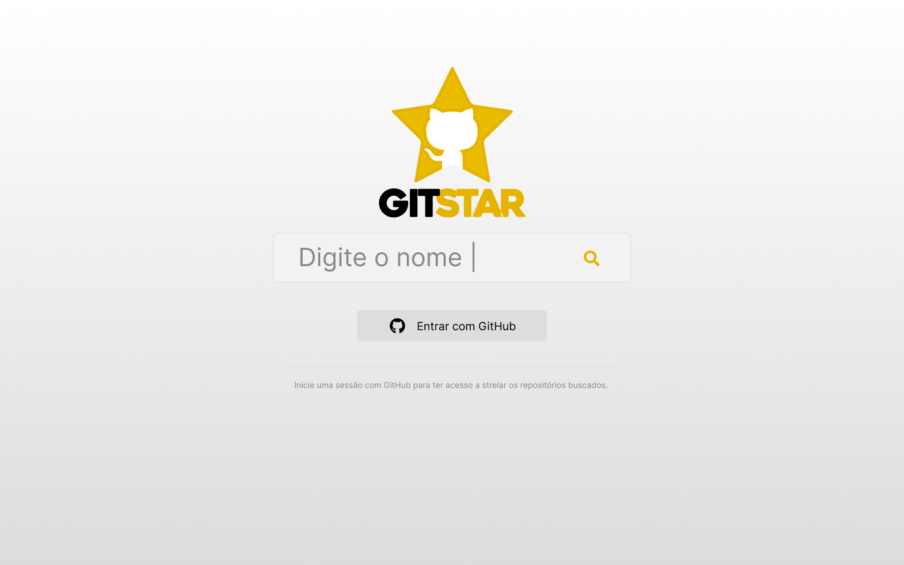

<p align="center">
  
</p>

<p align="center">Um jeito fácil de buscar os repositórios estrelados de um usuário GitHub</p>


<p align="center">
  
</p>
<p align="center">
  
</p>

## LAYOUT
Você pode visualizar o layout do projeto através do link:
[Figma Layout](https://www.figma.com/file/XtVvMV4QJg4ueBH8PO9tE7/GitHubStart?node-id=2%3A40)

## LIVE DEMO
Você pode visualizar o projeto rodando através do link:
[githubstart-wrjr.netlify.app](https://githubstart-wrjr.netlify.app/)

---

<p align="center">O Documento abaixo terá uma breve descrição do projeto</p>

_O projeto foi criado com uma simples necessidade de buscar os repositórios estrelados de um usuário do GitHub e quando autenticado no GitHub é possível estrelar também os repositórios listados_

Foi desensolvido em ReactJS com TypeScript e na parte visual foi utilizado Styled Components com Bootstrap.<br/>
Para a autenticação com o GitHub foi utilizado a biblioteca [Authentication do Firebase](https://firebase.google.com/docs/auth).<br/>
Para a consulta aos repositórios foi utilizado a [API GraphQL do GitHub](https://docs.github.com/pt/graphql)

***

>Você precisará do Node.js instalado no seu computador para construir este aplicativo.

## Clone do Projeto

Copiar o repositório basta efetuar o comando abaixo:

```
git clone https://github.com/willianjr/GitHubStar.git
$ cd GitHubStar
```
## Instalação das dependências

Após copiar o projeto será necessário instalar as dependências do projeto para isso basta rodar o comando abaixo na pasta do projeto:

```
$ NPM i
```
#### Tecnologias
- Axios: "0.21.4",
- Bootstrap: "5.1.1",
- Firebase: "9.1.0",
- Font Awesome: "4.7.0",
- React: "17.0.2",
- React Bootstrap: "2.0.0-beta.6",
- React Lottie: "1.2.3",
- Scrollreveal: "4.0.9",
- Styled Components: "5.3.1",
- Typescript: "4.1.2",
> 

## Configurações necessárias

O projeto utiliza duas APIs do GitHub GraphQl e do Firebase, com isso é necessário no arquivo de configuração *.env* preencher as informações necessárias.

- > [GITHUB GRAPHQL - DOCUMENTAÇÃO DE AUTENTICAÇÃO](https://docs.github.com/pt/graphql/guides/forming-calls-with-graphql#authenticating-with-graphql)
- > [FIREBASE - AUTHENTICATION](https://firebase.google.com/products/auth?gclid=CjwKCAjwhuCKBhADEiwA1HegObov2PqSUJ6YSZM3-JnfSW4EbZeuqEqngkFsgpggZbYqyUWcD4QBKBoCz_kQAvD_BwE&gclsrc=aw.ds)


```.env
#GIT HUB PERSON KEY
REACT_APP_GIT_API_KEY=********

#FIREBASE
REACT_APP_API_KEY= *******
REACT_APP_AUTH_DOMAIN= *******
REACT_APP_PROJECT_ID= *******
REACT_APP_STORAGE_BUCKET= *******
REACT_APP_MESSAGING_SENDER_ID= *******
REACT_APP_APP_ID= *******
REACT_APP_APP_MEASUREMENT_ID= *******

```

## Rodando
```
$ NPM start
```
